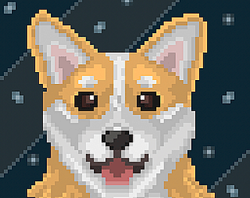

Hi i'm Alex, Im a Games Programmer, Abertay Dare Finalist (2025), 4th Year student at Abertay university studying Computer Games Applications Development . In my free time i take part in Game Jams, play DND and Paint 3d Models. I have a huge passion for creating video games, as i want to bring people together and help them create memories with friends and family. 

Below are some of my core projects. 
More Detail and projects can be seenon the porjects page.

# Core Projects 

 [Dare Academy Synaptic](https://bonny-bandits.itch.io/synaptic)
   
   
   
  
   
   
Synaptic is one of my biggest projects and is a game made for my 3rd year professional project class, which was then taken forward to Abertay's Dare Academy. 
  

   

 
 [Ba Ba BANG! Sheep](https://alex-onions.itch.io/ba-ba-bang-sheep)

  

   
  
   Ba Ba BANG! Sheep is a first year project which i have grown and worked on when not working each summer, making it into a mobile game.
 

  
### University Projects

 3rd Year Games Mechanics Project: Mesh Cutting
   
 
   The project was made for Game Mechanics Programming (3rd Year Class), i created a mesh cutting mechanic using C++ with minimal blueprints use.
   

    
  
[Mesh Cutting Git Page](https://github.com/AONIEX/MeshCuttingWORKING)

   [Mesh Cutting Video Demonstration](https://www.youtube.com/watch?v=rBjXFgnGRYU)

   

### Game Jam Games
For more information on these games please go to the projects page or check out their itch.io pages below
- [Blue](https://alex-onions.itch.io/blue)
- [The Reapers Garden](https://alex-onions.itch.io/the-reapers-garden)
- [Skuffed](https://alex-onions.itch.io/skuffed)
- [Bong](https://alex-onions.itch.io/bong)
- [Fire Breathing Space Corgi](https://alex-onions.itch.io/fire-breathing-space-corgi)
- [Magnus's Libary](https://alex-onions.itch.io/magnuss-libary)
- [Maledictum Colori](https://alex-onions.itch.io/maledictum-colori)
- [Clash Of The Roots](https://alex-onions.itch.io/clash-of-the-roots)
- [Breadpocalypse](https://park66.itch.io/brotc)
- [Paranormal Containmetn Protocl](https://park66.itch.io/paraconpro)
           
