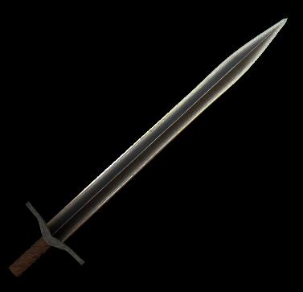
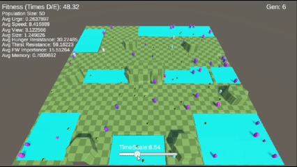

  <h1 style="font-size:2em; margin-bottom:0.3em;">Hi, I'm Alex</h1>
  

    Games Programmer • Dare Academy Finalist (2025) • 4th Year at Abertay University
  

## On Going Projects

  

  

    <h3 style="margin-top:0;">Honours Project</h3>
    
3D Sword Procedural Generation, creating historically accurate and visually appealing swords

    
    <!-- Tags -->
    

      C++
      Procedural Generation
      3D Graphics
    

    <a href="{{ 'Portfolio/honours/' | relative_url }}" 
       style="display:inline-block; margin-top:0.3em; padding:0.5em 1em; background:#00aaff; color:#fff; border-radius:6px; text-decoration:none; font-weight:bold;">
       See More
    </a>
  

## Featured Projects

  

  

    <h3 style="margin-top:0;">Synaptic</h3>
    
My 3rd year professional project, later showcased at Abertay's Dare Academy.

    
    <!-- Tags -->
    

      C#
      Unity
      Dare Academy
    

    <a href="{{ 'Portfolio/projects/#Dare_Academy' | relative_url }}" 
       style="display:inline-block; margin-top:0.3em; padding:0.5em 1em; background:#00aaff; color:#fff; border-radius:6px; text-decoration:none; font-weight:bold;">
       See More
    </a>
  

  

  

    <h3 style="margin-top:0;">Ba Ba BANG! Sheep</h3>
    
A first-year project grown into a mobile game, refined each summer.

    
    <!-- Tags -->
    

      C#
      Unity
      Mobile
    

    <a href="{{ 'Portfolio/projects/#BaBaBANGSheep' | relative_url }}" 
       style="display:inline-block; margin-top:0.3em; padding:0.5em 1em; background:#00aaff; color:#fff; border-radius:6px; text-decoration:none; font-weight:bold;">
       See More
    </a>
  

  

  

    <h3 style="margin-top:0;">Mesh Slicing</h3>
    
A 3rd Year Game Mechanics project where I built a mesh slicing system in C++.

    
    <!-- Tags -->
    

      C++
      Algorithms
      3D Geometry
    

    <a href="{{ 'Portfolio/projects/#Mesh_Cutting' | relative_url }}" 
       style="display:inline-block; margin-top:0.3em; padding:0.5em 1em; background:#00aaff; color:#fff; border-radius:6px; text-decoration:none; font-weight:bold;">
       See More
    </a>
  

  

  

    <h3 style="margin-top:0;">AI Evolution Simulation</h3>
    

      An AI simulation where creatures mutate and adapt to survive by seeking food and water.
    

    
    <!-- Tags -->
    

      C++
      AI / Mutation
      Simulation
    

    <a href="{{ 'Portfolio/projects/#AI_Mutation' | relative_url }}"
       style="display:inline-block; margin-top:0.3em; padding:0.5em 1em; background:#00aaff; color:#fff; border-radius:6px; text-decoration:none; font-weight:bold;">
       See More
    </a>
  

## Game Jam Projects

  

  

    <h3 style="margin-top:0;">Blue</h3>
    
A Game Jam project exploring mood and atmosphere through minimalist design.

    
    <!-- Tags -->
    

      C#
      Unity
      Game Jam
    

    <a href="{{ 'Portfolio/projects/#GameJams' | relative_url }}" 
       style="display:inline-block; margin-top:0.3em; padding:0.5em 1em; background:#00aaff; color:#fff; border-radius:6px; text-decoration:none; font-weight:bold;">
       See More
    </a>
  

  

  

    <h3 style="margin-top:0;">The Reapers Garden</h3>
    
“An endless wave survival game set in a Reaper’s garden.”

    
    <!-- Tags -->
    

      C++
      Unreal Engine
      Game Jam
    

    <a href="{{ 'Portfolio/projects/#GameJams' | relative_url }}" 
       style="display:inline-block; margin-top:0.3em; padding:0.5em 1em; background:#00aaff; color:#fff; border-radius:6px; text-decoration:none; font-weight:bold;">
       See More
    </a>
  

  

  

    <h3 style="margin-top:0;">Skuffed</h3>
    
A fast-paced game with chaotic mechanics, playful energy, and controlling your opponents arms.

    
    <!-- Tags -->
    

      C#
      Unity
      Local Multiplayer
    

    <a href="{{ 'Portfolio/projects/#GameJams' | relative_url }}" 
       style="display:inline-block; margin-top:0.3em; padding:0.5em 1em; background:#00aaff; color:#fff; border-radius:6px; text-decoration:none; font-weight:bold;">
       See More
    </a>
  

  

  

    <h3 style="margin-top:0;">Fire Breathing Space Corgi</h3>
    
A whimsical jam game featuring a corgi with cosmic powers.

    
    <!-- Tags -->
    

      C#
      Unity
      2D Arcade
    

    <a href="{{ 'Portfolio/projects/#GameJams' | relative_url }}" 
       style="display:inline-block; margin-top:0.3em; padding:0.5em 1em; background:#00aaff; color:#fff; border-radius:6px; text-decoration:none; font-weight:bold;">
       See More
    </a>
  

Explore more on the [Projects Page](/projects) or directly on itch.io:

- [Bong](https://alex-onions.itch.io/bong)  
- [Magnus's Library](https://alex-onions.itch.io/magnuss-libary)  
- [Maledictum Colori](https://alex-onions.itch.io/maledictum-colori)  
- [Clash Of The Roots](https://alex-onions.itch.io/clash-of-the-roots)  
- [Breadpocalypse](https://park66.itch.io/brotc)  
- [Paranormal Containment Protocol](https://park66.itch.io/paraconpro)
